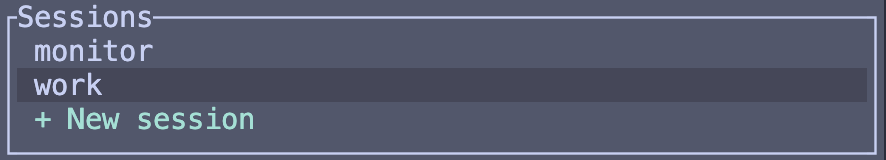

# tc-watcher

A terminal UI that gives you a live, color-coded overview of every active tmux pane — what process is running, what it is doing, and how long it has been in that state.

Built with special awareness of [Claude Code](https://claude.ai/code): panes running `claude` are classified into fine-grained states (Thinking, Executing, Awaiting Input, Done) so you can glance at the monitor and know exactly where each agent is in its work cycle.


---

## Download

Pre-built binaries are published automatically on every merge to `main`.

| Platform | Download |
|----------|----------|
| macOS (Apple Silicon) | [tc-watcher-aarch64-apple-darwin](https://github.com/jayfeng20/tmux-claude-watcher/releases/latest/download/tc-watcher-aarch64-apple-darwin) |
| macOS (Intel) | [tc-watcher-x86_64-apple-darwin](https://github.com/jayfeng20/tmux-claude-watcher/releases/latest/download/tc-watcher-x86_64-apple-darwin) |

```bash
# Apple Silicon
curl -L https://github.com/jayfeng20/tmux-claude-watcher/releases/latest/download/tc-watcher-aarch64-apple-darwin \
  -o tc-watcher && chmod +x tc-watcher && mv tc-watcher ~/.local/bin/

# Intel
curl -L https://github.com/jayfeng20/tmux-claude-watcher/releases/latest/download/tc-watcher-x86_64-apple-darwin \
  -o tc-watcher && chmod +x tc-watcher && mv tc-watcher ~/.local/bin/
```

---

## Quick start

> tc-watcher must be run from inside a tmux session. If you don't have tmux installed, visit [tmux](https://github.com/tmux/tmux)

Run tc-watcher in its own dedicated session so it never shares window space with your work.

```bash
tmux new-session -s watcher
tc-watcher
```

| Key | Action |
|-----|--------|
| `j` / `k` | Move selection down / up |
| `↵ Enter` | Jump to selected pane |
| `prefix + R` | Jump back to the monitor from anywhere |
| `n` | Create a new session, window, or pane |
| `d` | Delete selected pane |
| `?` | Help |

tc-watcher binds `prefix + R` on startup and removes it on exit. Pass `--return-key <letter>` to use a different key.

---

## More

<details>
<summary>Features</summary>

- **Live polling** — refreshes all panes every 2 seconds without blocking the UI
- **State classification** — distinguishes shell, Claude, and tc-watcher panes and their sub-states
- **Timing column** — shows how long each pane has been in its current state
- **Active column** — indicates panes that are truly receiving keyboard input
- **Jump to pane** — press `↵` on any row to switch your terminal directly to that pane
- **Return key** — registers `prefix + R` (configurable) so you can jump back to the monitor from anywhere
- **Create sessions / windows / panes** — press `n` to open a drill-down picker; select an existing session to add a window, or choose `+ New` at any level

  

- **Delete panes** — press `d` on the selected row and confirm with `↵`
- **Priority sorting** — Claude panes awaiting input or permission, and shell panes with a just-finished subprocess float to the top so they never get buried. Panes that got an update / are recently focused get higher priorities.
- **Non-intrusive logging** — writes to a rolling daily file in `/tmp`

</details>

<details>
<summary>Key bindings</summary>

| Key | Action |
|-----|--------|
| `↵ Enter` | Jump to selected pane |
| `j` / `↓` | Move selection down |
| `k` / `↑` | Move selection up (wraps) |
| `n` | Open session/window/pane creator |
| `d` | Delete selected pane (asks for confirmation) |
| `q` / `Q` | Quit |
| `?` | Toggle help panel |
| `Esc` | Close overlay / cancel |

To return to the monitor after jumping to another pane, press `prefix + R` (or whichever key was configured with `--return-key`).


</details>

<details>
<summary>CLI flags</summary>

| Flag | Default | Description |
|------|---------|-------------|
| `-r`, `--return-key <KEY>` | `R` | tmux prefix key bound to jump back to the monitor. |

Example — use `prefix + M` instead of the default:

```bash
tc-watcher --return-key M
```

</details>

<details>
<summary>Pane states</summary>

**Claude panes**

| Icon | Color | State | Meaning |
|------|-------|-------|---------|
| `◌` | orange | Thinking | Extended reasoning in progress |
| `◑` | yellow | Executing | Generating a response or running a tool |
| `❯` | red | Awaiting Input | Input box visible, Claude is asking a question |
| `!` | red | Awaiting Permission | Tool permission prompt needs approval |
| `✓` | green | Done | Task completed, input box visible, no question |
| `?` | dim | Unknown | State could not be determined |

**Shell panes** (`bash`, `zsh`, `fish`, `sh`)

| Icon | Color | State | Meaning |
|------|-------|-------|---------|
| `○` | green | Idle | Shell prompt visible — ready |
| `❯` | red | Awaiting Input | Shell is foreground but no prompt visible (e.g. `read`, sudo password) |
| `✓ <cmd>` | green | Just Finished | Subprocess completed successfully — clears when you focus the pane |
| `✗ <cmd>` | red | Just Finished | Subprocess exited with an error — clears when you focus the pane |

**tc-watcher panes**

| Icon | Color | State | Meaning |
|------|-------|-------|---------|
| `○` | green | Active | Monitor is running and polling |
| `⏸` | yellow | Paused | Pane is in tmux copy/scroll mode |

</details>

<details>
<summary>Requirements</summary>

- [tmux](https://github.com/tmux/tmux) installed; tc-watcher must be launched from inside a tmux session
- A terminal emulator with Unicode and 256-color support

</details>

<details>
<summary>Building from source</summary>

Requires [Rust](https://www.rust-lang.org/tools/install) 1.85 or later (edition 2024).

```bash
git clone https://github.com/jayfeng20/tmux-claude-watcher.git
cd tmux-monitor
cargo build --release
cp target/release/tc-watcher ~/.local/bin/
```

To run tests:

```bash
cargo test
```

</details>

<details>
<summary>Logs</summary>

Structured logs are written to `/tmp/tmux-claude-watcher.YYYY-MM-DD`. To stream them live:

```bash
tail -f /tmp/tmux-claude-watcher.$(date +%Y-%m-%d)
```

To increase verbosity:

```bash
RUST_LOG=debug tc-watcher
```

</details>

---

## Contributing

Contributions are welcome! Please open an issue before starting work on a non-trivial change so we can align on scope and approach.

1. Fork the repo and create a branch from `main`.
2. Make your changes and ensure `cargo test` and `cargo clippy --all-targets -- -D warnings` both pass.
3. Keep commits focused — one logical change per commit.
4. Open a pull request with a short description of what and why.

For bugs, please include the tc-watcher version, your tmux version (`tmux -V`), and steps to reproduce. (current in beta so probably still lots of bugs)

---

## License

[MIT](LICENSE)
